<style>
img[alt=pict04] {
   width:40%;
}
img[alt=pict06] {
   width:60%;
}
img[alt=pict08] {
   width:80%;
}
</style>


# Using TypeScript with React by Dmytro Danylov

#### Section 1 Intro

<details>
<summary>Expand</summary>

1. TS compiler configuration = "tsconfig.json". 
    1. Add file to root directory with the "package.json"

1. How it works
    1. When you launch `tsc` compiler
        1, `tsc` reads the "tsconfig.json" from the folder you launched from
        1. `tsc` gets the instructions about how to compile your project 
            1. which source files to compile
            1. where to store the output
            1. etc.
    1. `tsc` tell the compiler where to look for config using "-p" option:
        `tsc -p tsconfig.server.json`
1. Structure of the "tsconfig.json" looks like this:
    ```
    {
        "compilerOptions": {
            The options from the "Compiler Options" doc(https://www.typescriptlang.org/docs/handbook/compiler-options.html), like:
            "target": "es6",
            "outDir": "dist"
        }
        Other options, like:
        "files": [],
        "include": [],
        "exclude": []
    }
    ```

 1. most common compiler/tsconfig options:
    1. `"target": "es6"`
        1. `"target"` indicates version of ECMAScript you would like to compile your code to.
            1. Choose option based on environment you would like to run your code in. 
            1. example
                1. If you are targeting very old browsers
                    1. you might want to choose “ES5”. 
                1. If you are going to run your code in Node 12.10
                    1. you can set the target to “ES2019”,
                        1. according to https://node.green website ...
                            1. ES2019 is supported by this version of Node.
        1. Common values: 
            1. ES5
            1. ES6/ES2015
            1. ES2016
            1. ES2017
            1. ES2018 
            1. ES2019 
            1. ES2020
            1. ESNext
                1. Targets latest supported ES proposed features according to the “tc39 / proposals” document: https://github.com/tc39/proposals

    1. `"lib": ["dom", "dom.iterable", "esnext"]`
        1. List of library files to include during compilation
            1. Library files tell which features available in your TypeScript code. 
            1. Example... `DOM` library file
                1. Tells `tsc` how the DOM API looks
                1. When used...
                    1. `tsc` knows how to check JS DOM API like `document.querySelector("a")`

    1. `"strict": true`
    
        1. Enables all strict type checking options
            1. example
                1. noImplicitAny
                1. noImplicitThis
                1. alwaysStrict
                
    1. `"module": "commonjs"`
        1. Sets module system to be used in compiled (.JS) files
            1. Should pick module system that is supported by the environment where your code will run. 
                1. Example
                    1. Node.js uses CommonJS.
                1. code for the browser, 
                    1. have to combine `module` option with the `outFile` option. 
                    1. `outFile` tells `tsc` to bundle all your code into a single file
                        1. can include into an HTML file using a `<script>` tag.
                            1. in order to use compiled JS file in HTML file
                                1. should set up a corresponding module loader
                                1.like https://requirejs.org/ or https://github.com/systemjs/systemjs.
                        1. can be used only with AMD or SystemJS module systems
                        1. if use `outFile` option
                            1. should set the "module" option to either...
                                1. `amd` ...or... 
                                1. `system`
                    1. instead of using the "outFile" option
                        1. recommend using TypeScript with webpack to bundle your code:                
                            1. https://webpack.js.org/guides/typescript/
                        1. For REAL projects, use a framework, like     
                            1. Create React App
                                1. https://create-react-app.dev/
                            1. Next.js
                                1. https://nextjs.org/
                            
    1. `"moduleResolution": "node"`
        1. Defines how `tsc` resolves modules
            - how `tsc` looks at module import statements 
            - how `tsc` decides what should be imported given an import statement
                - like "import a from 'moduleA'"
        1. Value `node` tells `tsc` to mimic the Node.js module resolution strategy. 
        1. Options 
            1. `node`
            1. `classic`
                1. `classic` is deprecated 
                1. only for backwards compatibility.
    1. `"esModuleInterop": true`
        1. Allows us to `import default` from commonjs modules 
            1. modules that don’t have a default export 
                1. modules which didn’t export the "default" property
                    1. like React, as if they have it. 
        1. Example React used to be imported like this:
            - `import * as React from 'react'`
        1. With this option, import React like this...
            - `import React from 'react'`
    1. `"jsx": "preserve"`
        1. tells `tsc` how to transform the JSX code
        1. `"preserve"` option leaves JSX as is in compiled files
        1. `"react"` option turns JSX into the React API calls 
            - e.g., React.createElement('div')
        1. Usually `preserve` leaves the JSX transformation to a different tool in our build chain (e.g., Babel).
    1. `"skipLibCheck": true`
        1. Tells `tsc` whether to ...
            1. type check declaration(*.d.ts) files (yours and 3rd party packages) in your proj.
        1. Purpose
            1. to reduce compile time of a project
                1. by skipping the type checking of declarations
                    1. which were tested by their authors
                    1. which are known to work correctly
            1. `tsc` won’t go deep into checking the types of the third party packages
                1. still checks our code against type definitions provided by these packages.
    1. `"files": ["./file1.ts", "./file2.d.ts", …]`
        1. Lists files which `tsc` should always include in the compilation. 
        1. files included using this option are included regardless of the `"exclude"` option.
    1. `"include": ["src/**/*"]`
        1. Lists files we’d like to be compiled
            1. `"files"` option requires relative or absolute paths to the files
            1. `"include"` option allows glob-like patterns, like:
                - "**" - any subdirectory
                - "*" - any file name
                - "?" - a character followed by question mark becomes optional (e.g., "src/*.tsx?")
                - "exclude": ["node_modules", "**/*/*.test.ts"]
    1. `"exclude": ["node_modules", "**/*/*.test.ts"]`
        1. Excludes files from compilation
            1. accepts same patterns as "include" option
        1. can use this option to filter files specified using "include" option
        1. this option doesn’t affect the "files" option.
        1. files/folders to exclude
            1. node_modules, 
            1. test files, 
            1. compilation output directory
        1. if `exclude` is never used...
            1. `tsc` will exclude folder specified using "outDir" option.
    1. If `"files"` and `"include"` are NOT specified...
        1. `tsc` will compile all TS files ...
            1. from root directory and any subdirectory ...
            1. excluding files specified using `"exclude"` option.

                    
</details>

#### Section 2 TypeScript

<details>
<summary>Expand</summary>

##### Types

<details>
<summary>Expand</summary>
1. Types
    1. Boolean
        1. 
    1. Number
        1. 
    1. String
        1. Don't forget `'` and `"` are different
        1.  
    1. Nulls
        1. 
            1. 
        1. Strict null checks
            1. Pro
                1. It will red-check and read into code
            1. Con
                1. It will prevent you from assigning null
                    1. 
                1. Only way around it... if check
                    1.  
    1. Primitive Types
        1. 
    1. Objects
        1. CANNOT ASSIGN a Primative Type... must be an object
            1. 
        1. CAN ASSIGN
            1. Array
                1. 
            1. Map
            1. Object
            1. Void
    1. Void
        1. describes an absence of a value
        1. used with functions
            1. 
            1. 
    1. Tuple
        1. like an array.... but you can mix types
            1. 
    1. Enum
        1. Allows you define assignable variable
            1. 
            1. 
        1. Why use it?
            1. Forces users/programs to use a set of values
                1. Instead of using `number` for a question
                    1. use an `enum` of `1`, `2`, `3`, or `4`
    1. Walk through
        1. abbreviate your target
            1. 
        1. type guard your response logic
            1. 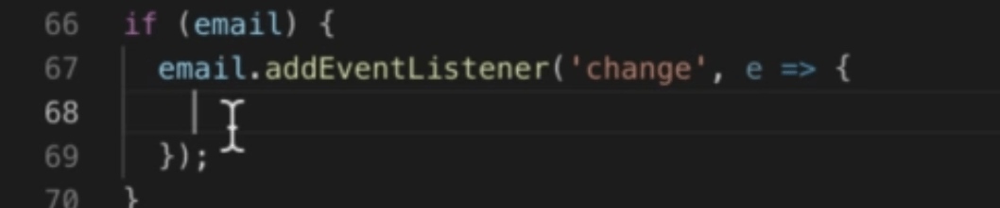
        1. check your type logic
            1. 
        1. assert as HTML input element
            1. 
        1. NOTE!!!!!
            1. `<generics>` conflict with JSX in `.tsx` files
1. Types part 2
    1. Interfaces
        1. When to use...
            1. Creating a pizza with ONLY `class`
                1. 
            1. When you describe a pizza ... but not use
                1. 
        1. Why does this work?
            1. 
                1. because both variables have the same shape
                1. when you add another variable
                    1. 
                1. you get an error
                    1. 
        1. Make a parameter optional
            1. 
        1. Make a parameter immutable [can't be changed once accpeted]
            1. 
            1. 
    1. Index Signature
        1. establishing the index's type
            1. 
    1. Call signature
        1. establishing the return's type
            1. 
    1. Extending Interface
        1. Similar to extending a class
            1  Can combine... but NOT MODIFY if a child
            1. 
    1. Interface vs. Types
        1. Interface format
            1. 
        1. Type format
            1. 
        1. Putting it with Class
            1. 
        1. Working with function
            1. How it works with `type`
                1. 
            1. How it works with `interface`
                1. 
                1. 
        1. 
        1. 

</details>

##### Functions

<details>
<summary>Expand</summary>

1. Functions
    1. Basic Format for typing
        1. 
    1. Cool tricks
        1. specifying that all arguments should be numbers.
            1. 
        1. Specifying first to be a sting, secong boolean, and rest as numbers
            1. 
    1. Walk Through
        1. How do you calculate area with types
            1. 
        1. Set a conditional for two
            1. 

</details>

##### Classes


<details>
<summary>Expand</summary>

1. Classes
    1. Construct a class
        1. 
    1. Extend a class
        1. 
            1. `super` refers to the parent... `Robot`
            1. `this` refers to the instance... `FlyingRobot`
    1. Implement class
        1. 
    1. Modifying class properties
        1. 
            1. 
        1. 
            1. Cannot be accessed OUTSIDE of class
                1. 
            1. Still accessible to subclasses
                1. 
    1. `set` methods in class
        1. 
            1. Ensure to call properties as `this.`
                1. ensures to reference the INSTANCE... not class as a whole
        1. Example
            1. 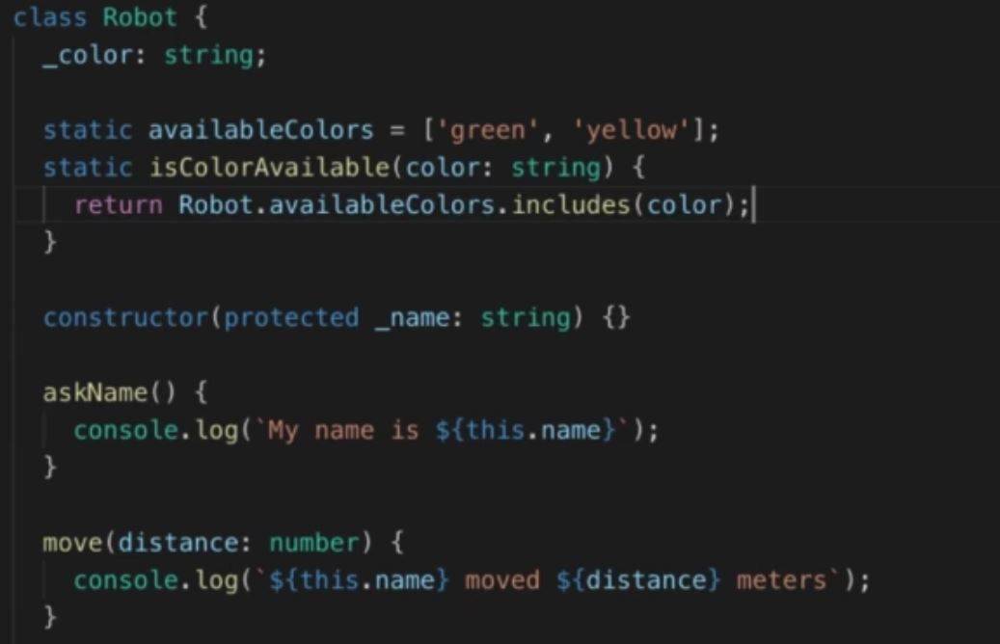
            1. 
            1. 
        1. `static` variables / methods CANNOT be inherited by `super`
            1. 
        1. Why use `static` variables / methods at all?
            1. Allows you to invoke within subclass without invoking parent
                1. Creating a `PizzaMaker` class
                    1. 
                1. Implementing static allows you to return a new class with
                    1. 
                1. Without `static`
                    1. 

</details>


##### Private Fields

<details>
<summary>Expand</summary>
                    
1. ECMAscript Private Fields
    1. Annotate private fields with `#`
        1. 
    1. So what is new?
        1. Preventes Other class from taking the name
            1. 
        1. 
    1. `#` vs `private`
        1. 
        1. 

</details>


##### Interfaces

<details>
<summary>Expand</summary>

1. Interfaces
    1. Creating a Shopping Cart and SpendingCalculator
        1. Calculator exports a function `calculateTotalAmount`
            1. Takes in `IOrder` and returns cost after discount and tax
            1. 
        1. When you want a class to assume an interface...
            1. 
        1. Connecting the two
            1. 
            1. `Shopping-Cart.ts` implements `IOrder`, but nevers sees how `caclulateTotalAmount` works
        1. Tying code via `interface` is a solid way of privatizing data
            1. 
            1. 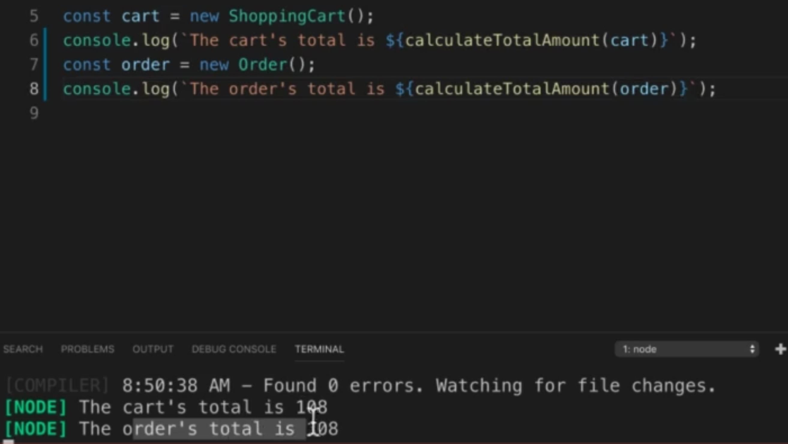
    1. What you can use with interfaces
        1. Cannot access both `instance` within `constructor` and `static`
            1. 
        1. 
        1. 
        1. If you set an interface
            1. 
        1. And you implement a class
            1. 
        1. And you utilize class method
            1. 
                1. TS only sees the interface `Animal` and NOT `dog` class
        1. if you force the recognition of `Animal`'s instance of `dog` via generics
            1. 
        1. you can have BOTH `Animal` methods and `dog` methods by...
            1. using generics and extending the parent class
                1. 
            1. recogizes the generic
                1. 


</details>

##### Generics

<details>
<summary>Expand</summary>

1. Generics
    1. Generics
        1. Custom Types
            1. cannot use generic type parameters to describe ...
                1. static properties 
                1. static methods.
            1. 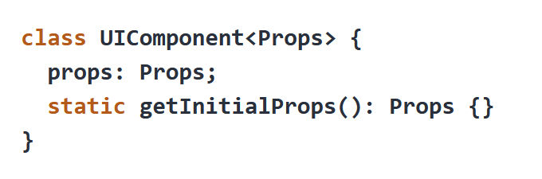
    1. Importing a Generic
        1. 
    1. Importing multiple Generic to use within a `function`
        1. 
        1. 
    1. Importing generic INSIDE of a function
        1. 
    1. Big benefit of using generic
        1. use on both `instance` side and `static`/`class` side
            1. 
    1. Exercise -- Cakes
        1. `any` is a problem? How would you get `items` away from `any`?
            1. 
                1. Import `<Item>` to the argument and specify `items` as an array of `<Item>` type 
                1. 
        1. Another problem... `<Item>` does not describe a `.expiryDate`
            1. 
                1. `extend` the parent class that owns that property
                1. 
        1. Using generics for specific cakes
            1. Define interface that extends the `expiryDate`
                1. 
                    1. `ChocolateCake` gets its own interface
                    1. `VanillaCake` gets its own interface
            1. Assign the interface to get only ChocolateCakes / VanillaCakes
                1.  
        1. Creating a function that retrieves an array of expired cakes
            1. 
                1. Functions does NOT import generic
                1. Import generic as an extended version
                    1. 
                1. Specify that the function ...
                    1. takes in an array of said generic
                        1. 
                    1. outputs an array of said generic
                        1. 
    1. Exercise -- Shopping cart
        1. Create an interface for `ShoppingCart` that holds an array of `items` that allows you to add and get by id
            1. 
                1. Two key properties
                    1. `price` and `id` of item
                1. Need to pass two important types
                    1. `<ItemId>` and `<Item>`
        1. Create `cart` that instiates an instance of `ShoppingCart` and specifies the methods
            1. 
        1. Problem
            1. `items` is registered as `any`
            1. SOLUTION - specify `this` for `ShoppingCart`'s methods
                1. 
            1. Check
                1. 
        1. Problem
            1. ...but `getItemById` has an error
                1. 
                1. `undefined` is NOT accepted within our defintion of `Item`
                    1. `.find` has the potential of returning `undefined`... `undefined` must be a returnable type if you use `.find`
            1. SOLUTION
                1. Instead of backtracting to the original `Item` type...
                1. Merely attach `undefined` to the method's return type

</details>

##### Union

<details>
<summary>Expand</summary>

1. Union
    1. Problem -- string methods with numbers
        1. Using a union when you call a string method.
            1. 
        1. Solution - type guard `if`
            1. 
        1. What if you want to use boolean?
            1. 
    1. Applying Unions with Interfaces
        1. Scenario... Dog and Cat interfaces
            1. 
        1. Problem - union - interfaces have different methods
            1. Trying to make a `Cat` `.bark()`
                1. 
            1. Solution
                1. ASSERT that it is dog PRIOR TO `.bark()`
                    1.             
                1. Assertion is UGLY...
    1. Another Solution -- Custom Type Guard
        1. set a function for dog-checking
            1. 
                1. `: SomeObj is Dog { /* something dog does !== undefined */}`
                    1. sets `SomeObj` to dog **ONLY IF** `{}` returns true
        1. insert type guard
            1. before
                1. 
            1. after
                1. 
    1. Overall
        1. no way to properly type check
            1. without checking the type methods

</details>

##### Intersection

<details>
<summary>Expand</summary>

1. Intersection Type
    1. Purpose
        1. Combines `&` types/interfaces into a singular type
    1. Example
        1. 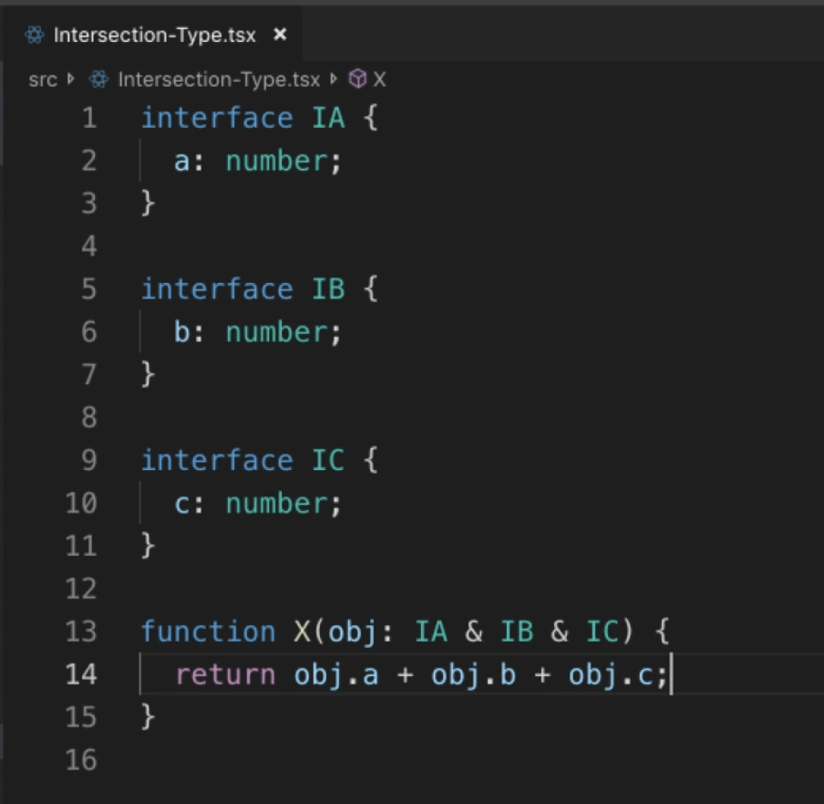 
        1. 
        1. PROBLEM
            1. Overview
                1. 
                1. `resultObj` is an `any` type
            1. SOLUTION Part 1
                1. declaring inputs as types `ObjA` and `ObjB`
                    1. 
                1. check if TS acknowledged
                    1. 
            1. SOLUTION Part 2
                1. explicitly declaring type returned
                1. 
        1. PROBLEM #2
            1. OVERVIEW
                1. 
                1. `objA` and `objB` can be different types
            1. SOLUTION part 1
                1. Force them as objects via `extends object`
                    1. 
                1. Check
                    1. 
                1. Using object
                    1. 
</details>

##### Type Alias

<details>
<summary>Expand</summary>


1. Type Alias
    1. Definition
        1. Create a name for a custom type
            1. Union
            1. Intersection
            1. Generic
            1. Interface
    1. When to use
        1. 
    1. Quiz
        1. 

</details>

##### External Packages / Types

<details>
<summary>Expand</summary>

1. Using External Packages and Their Types
    1. Utilize hover to check dependency
        1. 
    1. To go to dependency
        1. 
        1. 
    1. Checking for dependencies
        1. Hovering over `'library'`
            1. 

</details>

##### Declaration Merging

<details>
<summary>Expand</summary>

1. Declaration Merging
    1. You can merge
        1. Declaration
        1. Interfaces
        1. Namespaces
    1. ... but ... you can't merge
        1. Modules...
            1. just modify them
    1. Merging interfaces
        1. three different interfaces
            1. 
            1. implementing a cart that allows for BOTH versions of `calculateTotal()`
                1. 
    1. Merging namespaces
        1. merging two namespaces
            1. 
            1. defining an interface that draws from BOTH versions of `MyNamespace`
                1. 
            1. NOTE... cannot export NON-EXPORTED namespace properties/methods
                1. 
                    1. 
        1. Merging namespaces [similar to extending... except for everything]
            1. Allows you to add functions to types
                1. Merging functions into a namespace
                    1. 
                        1. `someFunction` now has `someProperty` attached
                        1. 
                1. Merging `enum` into a namespace
                    1. 
                        1. utilized `namespace` to add a function to an `enum`
                    1. 
    1. Augmenting a module
        1. Focusing on `React` module
            1. Checking inside module first
                1. Inside original `react` module... `Component` interface
                    1. 
            1. Import... declare... type... define... use
                1. 
        
        

</details>

##### Utility Types

<details>
<summary>Expand</summary>

1. Utility Types
    1. Definition
        1. Exportable modifier that can be reused to ...
            1. modify types
        1. 
    1. `Partial<T>`
        1. Definition
            1. converts required properties of interface into optional
        1. Overview
            1. 
        1. Example
            1. 
            1. Fixed
                1. 
    1. `Required<t>`
        1. Definition
            1. converted properties into REQUIRED status
        1. Overview
            1. 
    1. `Readonly<t>`
        1. Definition
            1. converted properties into READONLY status
        1. Overview
            1. 
    1. `Record<K,T>`
        1. Definition
            1. converts into map-like object
        1. Overview
            1. 
        1. Example
            1. 
    1. `Pick<T,K>`
        1. Definition
            1. Allows you to isolate certain required properties of Type
        1. Overview
            1. 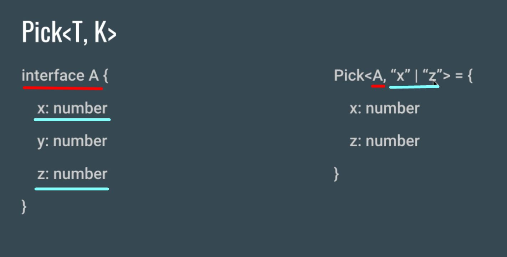
        1. Example
            1. 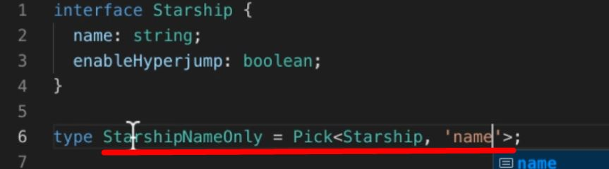
    1. `Omit<T,K>`
        1. Definition
            1. Opposite of `Pick`, `K` are the properties to omit
        1. Overview
            1. 
        1. Example
            1. 
    1. `Exclude<T,U>`
        1. Definition
            1. Instead of properties, allows us to rid of a type
        1. Overview
            1. 
        1. Example
            1. 
            1. 
    1. `Extract<T,U>`
        1. Definition
            1. Instead of properties, allows us to select specified type options
        1. Example
            1. 
    1. `NonNullable<T>`
        1. Definition
            1. Allows us to select type options... getting rid of `null`/`undefined` as a type option
                1. why?
                    1. because some properties are optional
                    1. `?` optional permits `undefined` as a type option 
                        1.
                1. NOTE
                    1. only works if `strictNullChecks` is enabled in `tsconfig.json`
                        1. 
        1. Overview
            1. 
        1. Example
            1. 
                1. BOTH `null` and `undefined` are NOT PERMITTED
    1. `ReturnType<T>`
        1. Definition
            1. Returns the type specified within `<>`
        1. Overview
            1. 
        1. Example
            1. 
    1. `InstanceType<T>`
        1. Definition
            1. Used on instance, returns name of class used to generate instance
        1. Overview
            1. 
        1. Example
            1. 
            1. 
                1. we create a Profile CLass that calls delete
                    1. how do we ensure what instance it is... `car` or `user`
            1. 
                1. 
    1. `ThisType<T>`
        1. Deintioin
        1. Overview
            1. 
                1. MUST ENABLE `noImplicitThis`
                1. 
        1. Example
            1. 
            1. 
            1. 
            1. 
        1. Putting it all together
            1. 
                1. 

</details>

##### Mapped Types

<details>
<summary>Expand</summary>

1. Mapped Types
    1. 
        1. 

</details>

##### Conditional Types

<details>
<summary>Expand</summary>

1. Conditional Types
    1. 
        1. 

</details>

##### TS Tips

<details>
<summary>Expand</summary>

1. 25. TypeScript Tips
    1. 
        1. 

</details>

<hr />

</details>


<details>
<summary>Expand</summary>

#### Section 2 TypeScript With React

##### Intro

<details>
<summary>Expand</summary>

1. TypeScript with React - section Intro
    1. 
        1. 

</details>

##### What is webpack

<details>
<summary>Expand</summary>

1. What is webpack?
    1. Overall
        1. Consolidates a development for a more efficient production 
            1. 
    1. configured with...
        1. `webpack.config.js`
    1. How do you fix `.ts` files prior to consolidation
        1. loaders
            1. 

</details>

##### Setting up a webpack project

<details>
<summary>Expand</summary>

1. Setting up a webpack project
    1. Install webpack with its cli
        1. 
    1. Add scripts to the `package.json`
        1. start with a `build` for production mode
            1. 
        1. Test
            1. Run build
                1. 
            1. check for build files in `dist`
                1.  
    1. incorporate html capabilities
        1. Add plugin for webpack's html
            1. 
        1. configure webpack with `webpack.config.js`
            1. 
                1. 
            1. 
                1. 
                1. 
        1. incorporate into npm scripts
            1. 
            1. 
 
</details>

##### TypeScript setup options

<details>
<summary>Expand</summary>

1. TypeScript setup options
    1. two ways to compile `.ts` into `.js`
        1. `ts-loader`
            1. overivew
                1. 
            1. two key features
                1. type checks
                1. compiles `.ts` into `.js`
            1. can be combined with babel
                1. 
        1. `babel-loader` with babel presets
            1. overview
                1. 
            1. Pro's Cons
                1. Pro
                    1. efficient for emovint TS syntax
                1. Con
                    1. NO type-checking
            

</details>

##### Setting up TypeScript using ts-loader

<details>
<summary>Expand</summary>

1. Setting up TypeScript using ts-loader
    1. Install
        1. 
    1. `tsconfig.json`
        1. `compilerOptions`
            1. 
            1. uses `target` to set desired format
            1. use `module` to import `es6`
                1. 
            1. `strict` enables more options
                1. 
    1. configuring `webpack.config.js` to find `index.ts`
        1. 
        1. 
    1. Apply `ts-loader` locally for type-checking
        1. select `.ts` file and specify TS version
            1. 
        1. Pick WorkSpace Version to generate local files
            1. 
        1. Verify local files [`.vscode` folder]
            1. 
         

</details>

##### Setting up TypeScript using babel-loader

<details>
<summary>Expand</summary>

1. Setting up TypeScript using babel-loader
    1. Install needed items
        1. 
            1. `preset-env` brings JS syntax
            1. `preset-typescript` brings TS syntax
    1. Configure Babel with `.babelrc` with presets
        1. 
    1. Install `babel-loader`
        1. 
    1. Setup `webpack.config.js` with `babel-loader`
        1. 
    1. Class syntax
        1. Before class typing... all classes looked like this
            1. 
        1. If you use new JSX class proposal...
            1. 
        1. install `plugin-propasal-class-properties`
            1. 
    1. Working with typescript
        1. Will compile without errors, but still Type-Checks
            1. 
        1. Configuring TypeScript to work with Babel
            1. `tsconfig.json`
                1. 
            1. configure `package.json`
                1. 
            1. isolated Modules
                1. 
                    1. 
            1. LibCheck
                1. Imported libraries can NOT be checked with `isolatedModules` enabled
                    1. 
                1. Need to enable `skipLibCheck`
                    1. 
        1. Overall setup
            1. Overview
                1. run `tsconfig.json`
                1. run `webpack`
                    1. webpack automatically starts babel with `babel-loader`
            1. What it looks like in `package.json`
                1. 
            
</details>

##### Adding React

<details>
<summary>Expand</summary>

1. Adding React
    1. Install React development
        1. 
    1. Install React type defintions
        1. 
    1. Warning- JSX is NOT recognized
        1. Without proper JSX configuration...
            1. 
        1. Configuring `tsconfig.json` for JSX
            1. Two Options
                1. 
            1. `preserve`
                1. compiles `<div></div>`
                    1. into `<div></div>`
            1. `react`
                1. compiles `<div></div>`
                    1. into `React.createElement('div')`
    1. What it should look like
        1. `index.tsx`
            1. 
        1. `index.html`
            1. 
    1. Configure Babel to handle React
        1. install Babel's react preset
            1. 
        1. configure `.babelrc`
            1. 
                1. NOTE!!!! 
                    1. Babel presets are LOADED in REVERSE
                    1. This case
                        1. Typescript is loaded prior to react
</details>          

##### Adding a source map

<details>
<summary>Expand</summary>

1. Adding a source map
    1. Basic 
        1. a way to pack 
    1. Development 
        1. 4 ways of source map in webpack
            1. 
            1. 
        1. Implement choice
            1. 
    1. Production
        1. 4 ways of source map 
            1. 
        1. `source-map` generated reference comment
            1. 
                1. NOTE - source-map will have source code
        1. `hidden-source-map`
            1. 
                1. never put source-map on webserver
        1. if you are not using `babel-loader` and using `ts-loader`
            1. 
1. Reference

<details>
<summary>Expand</summary>
1. 

</details>

</details>

##### Function components

<details>
<summary>Expand</summary>

1. Function components
    1. Separating code into components
        1. Inspecting `.render` 
            1. 
            1. 
                1. if you change type within `.render`
                    1. 
                    1. 
        1. Importing `.json`
            1. 
        1. Fix error by configuring `tsconfig`
            1. 
            1. 
    1.  Creating a functional component
        1. Purpose
            1. receives a generic type parameter
                1. 
        1. Interface
            1. stovepipes for type-checking variables within component
                1. 
        1. Rendering list items
            1. 
        1. Implement in `App.tsx`
            1. 
    1. Outcome
        1. 


</details>

##### Setting up CSS Modules

<details>
<summary>Expand</summary>

1. Configuring for Main CSS
    1. Main CSS 
        1. 
    1. Import into `index.ts`
        1. 
    1. Configure `webpack.config.js` to handle `.css` files
        1. 
        1. **NOTE!!** Must install `css-loader` for webpack
            1. 
    1. Configure `webpack.config.js` to append `.css` files
        1. 
            1. `css-loader` only parses; never inserts into files
        1. utilize plugin
            1. 
        1. **NOTE!!** Must install and import `mini-css-extract` plugin for webpack
            1. 
            1. 
1. Configuring for CSS Modules
    1. Instead of `css-loader`...
        1. Prior...
            1. 
        1. Enable CSS Modules
            1. 
    1. Creating CSS Module
        1. 
    1. Implementing CSS Module
        1. 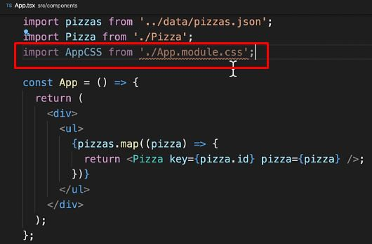
            1. **NOTE!!!** Must declare a CSS type declaration to recognize CSS Modules
                1. 
                    1. 
                1. 
    1. Attaching CSS Module to `<div>`
        1. 
1. PROBLEM -- TypeScript cannot parse `App.module.css` for all the different classes
    1. SOLUTION -- `typescript-plugin-css-modules`
        1. Install plugin as a dev dependency
            1. 
        1. Configure `tsconfig` to utilize plugin
            1. 
        1. Once configured...
            1. 
1. Walkthrough
    1. Create a module for Pizza component
        1. 
    1. Implement within Pizza component
        1. 
    1. Check result
        1. 
        
</details>

##### Importing SVGs - adding a logo

<details>
<summary>Expand</summary>

1. Importing SVGs - adding a logo
    1. New file format... new webpack configuration [loader, type description]
        1. loader - configure new module rule
            1. install type description
                1. 
            1. new rule in webpack configuration
                1. 
        1. type description
            1. 
            1. 
                1. Researching for how to declare SVG
                    1. Click on `React`
                        1. 
                    1. Search for SVG
            1. FIXED!
                1. 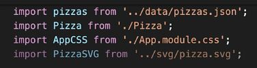
    1. Insert
        1. 
            1. 
    1. Fixing - disabling SVG's viewbox
        1. 
            1. 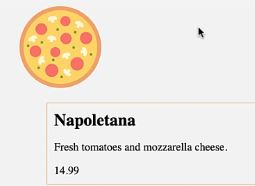
    1. Applying CSS styles from module
        1. 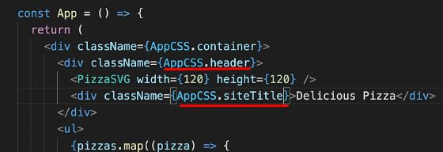
            1. 
</details>

##### Class components

<details>
<summary>Expand</summary>

1. Class components
    1. Overview
        1. 
            1. Highlighting shows that `React.Component<>` takes in ...
                1. Type of Props or `P`
                1. Type of State or `S`
                1. Type of Snapshot or `SS`
                    1. `getSnapshotBeforeUpdate()` holds functions to be invoked 
                        1. right before the most recently rendered output is committed to DOM
                    1. Enables your component to capture some info from the DOM (e.g. scroll position) 
                        1. before it is potentially changed
                    1. Values returned will be passed as a parameter to componentDidUpdate().
    1. To use Component... need to type define P,S
        1. 
    1. Define class
        1. within class
            1. establish `constructor` to define how props and state interact
                1. 
            1. establish what is `render()`'ed and `return()`'ed
                1. 
        1. export what you want
            1. 
    1. Implement Class within `App.tsx`
        1. Import and execute
            1. 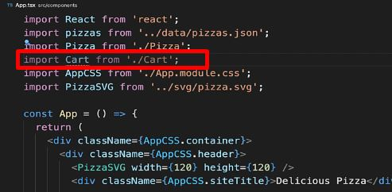
            1. 
        1. Checking results
            1. 
    1. Adding an icon
        1. Install `react-icons`
            1. 
        1. Import
            1. 
        1. Render
            1. 
        1. Check result
            1. 
    1. Hide/Show list
        1. Establish `display` status based on state of `isOpen` 
            1. 
        1. Create a `onClick` `<Button>` to change state of `isOpen`
            1. merely establishes `isOpen` as to the `!`opposite of `prevState.isOpen`
                1. 
        
            

</details>

##### Handling events using React

<details>
<summary>Expand</summary>

1. Handling events using React
    1. MouseEvent
        1. closer inspections
            1. `onClick()`
                1. 
            1. `e` is a `React.MouseEvent` / `HTMLButtonElement` type
                1. 
    1. Moving eventhandler outside of `render()`
        1. What it should look like...
            1. 
        1. type of `e` changed... to `any`
            1. 
        1. How to fix the `any` situation...
            1. need to hunt down the type ... further down the chain
                1. 
            1. need to copy and paste type into the `handleClick()` function
                1. 
    1. ERROR!!! - `Cannot read property 'setState'`
        1. When you click...
            1. 
        1. Why?!??!
            1. `handleClick()` function is NOT bound to the cart
            1. cart's state is not connected to same instance of `handleClick()`
        1. The fix...
            1. bind the function within constructor
                1. 
            1. ...or... use arrow functions to imply binding 
                1. 
    1. two type of `e` events
        1. types
            1. `e.target`
            1. `e.currentTarget`
        1. Using `console.log` to determine what is `e` sent within `.handleClick()`
            1. 
            1. 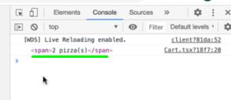
        1. Therefore... `e.target` sends `<span>` within `<button>`... not the `<button>` itself
            1. If `e.target` can be anything ... TS can NOT SPECIFY `e.target` type
            1. so... what does TS label `e.target` ...
                1. 
                    1. `EventTarget` generic type
        1. PROBLEM!!! - both icon and span are selectable...
            1. Overview
                1. Both Icon and Span are selectable...
                1. How do you ascertain the difference?
            1. `EventTarget` methods
                1. Hold over `e.target` and you get three methods for TS DOM elements
                    1. 
                    1. 
                    1. 
            1. Get `.nodeName` property of HTMLElement
                1. Force `EventTarget` into HTMLElement
                    1. 
                1. Check if `span`
                    1. 
                1. Look at properties of `span`
                    1. TS reads the properties of `span`
                        1. 

</details>

##### Using React context and the useState

<details>
<summary>Expand</summary>

1. Using React context and the useState
    1. Method for creating state
        1. Working on context store
            1. Create a separate document for storing state [`AppState.tsx`]
                1. Import `createContext` and default export it
                    1. 
            1. Define what is inserted with `interface`
                1. Create a `cart` object that holds an `items` array 
                1. `items` array holds objects with `name` string and `price` number properties
                    1. 
            1. Define initial values while applying `AppStateValue`
                1. 
            1. Insert initial values into the export statement of `createContext()`
                1. 
        1. Working on providing context store via `Provider`
            1. Implement Context via `Provider` and `React.FC`
                1. 
            1. `useState` to define state within `Provider`
                1. 
            1. ensure state is properly typed
                1. 
                    1. noticed it inferred type from the default parameter
            1. complete functional component by allowing `{children}` passage
                1. 
            1. export `Provider` and then import it in main `App.tsx`
                1. 
                1. 
                1. 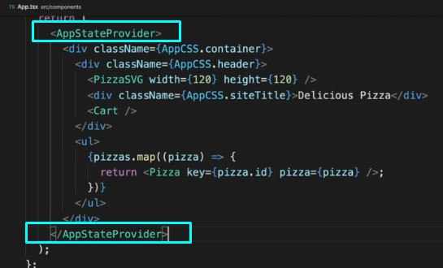
            1. PROBLEM!!!! Downstream components need to `setState`
                1. SOLUTION 1 - combine `state` with `setState` into a single provided object
                    1. what it would look like
                        1. 
                    1. PROBLEM...
                        1. all object in `children` are re-rendered each time `setState` is activated
                        
                1. SOLUTION 2 - create a separate `setState` context 
                    1. 
                    1. Semantics
                        1. Simply providing AppSetStateContext and value of setState doesn't give TS detailes that `setState` is being accepted
                            1. 
                        1. AppSetStateContext accepts `setState` as a parameter, but it is undefined
                            1. 
                        1. Need to get `setState` type so you can type-check
                            1. 
                        1. copy as a generic type
                            1. 
                            
                        
            1. Implement `context` via `Consumer`
                1. Import
                    1. 
                1. Utilize arrow function that inserts `state`
                    1. 
                1. Implement state
                    1. 
                        1. Read `state.cart.items.length` to display total items in cart
                        1. `.map` through each of the `state.cart.items` to display `item.name` and `item.id`
            1. Implement `AppSetStateContext` to manipulate state with a button
                1. Import
                    1. 
                1. Define an instance that implements `AppSetStateContext` within `useContext`
                    1. 
                1. Create button and handleClick function
                    1. handleClick function
                        1. in defining `setState()` with a parameter `state` you get an error
                            1. 
                            1. `state` error is due to `state` possibly being `undefined`
                                1. 
                            1. FIX... type check with an `if` statement INSIDE OF `AppState.tsx`
                                1. 
                            1. Put logic outside of the `export` for siomplicity
                                1. 
                            1. Utilize `useSetState` from `AppState.tsx`
                                1. 
                            1. Remove `handleClick` from `return()`
                                1. 
                            1. Deconstruct `state` and include new `cart`
                                1. 
                                    1. deconstruct state
                                    1. deconstruct cart
                                    1. deconstruct items
                    1. Insert `handleClick` within button
                        1, 
            1. New Problem -- Condense Multiple of Same Item into Numerics
                1. What the Problem looks like...
                    1. 
                1. How to work around problem
                    1. Implement `quantity` properties for each item defined in `AppState.tsx`
                        1. 
                    1. Find if the item is in cart... PRIOR TO UPDATING STATE
                        1. 
                    1. Right before updating cart items... implement `itemExists` to update item `quantity` by one
                        1. 
                1. Implementing visual
                    1. 

</details>

##### Replacing setState with useReducer

<details>
<summary>Expand</summary>

1. Replacing setState with useReducer
    1. Current Position
        1. State is being stored in `Pizza.tsx`
        1. State should be globally accessed
    1. Where we want to go
        1. Put state in globally accessible `AppState.tsx`
    1. How to organize global state
        1. Reducer
            1. Function you create
            1. Updates state according to an action
            1. takes in `state` and `action`
        1. useReducer
            1. 
            1. 
    1. Creating a Reducer in `AppState.tsx`
        1. Define state 
            1. Arrow function with `state` and `action`
                1. 
        1. Be aware of types
            1. State is defined as `AppStateValue`
                1. Type was already defined
                    1. 
                1. Take values from `AppStateValue` can create a share interface called `CartItem`
                    1. 
                
            1. action needs to be defined
                1. Problem...
                    1. `state` has `AppStateValue` as a type
                    1. `action` does NOT have a type
                        1. 
                1. Because `CartItem` is properly abstracted...
                    1. It can be re-utilized to check state going into `action`
                1. define Action type that defines itself based on generic
                    1. 
                1. Define `AddToCardAction` interface based on `CartItem` and Action type
                    1. 
                1. Define `action` as `AddToCardAction`
                    1. 
                1. When you need to add more action types...
                    1. use enum ... `|`
                        1.        
        1. basic purpose of `reducer`
            1. overview
                1. `if...` checks for `action.type` and performs pre-determined function on `action.payload`
            1. setup `if...` for reading `ADD_TO_CART`
                1. 
            1. Copy `itemExists`, destructing pizza `item` and quantity logic from `Pizza.tsx`
                1. 
            1. REMEMBER... this is a reducer... need to define `action.payload`
                1. 
                    1. REMEMBER to change all `pizza` into `action.payload.item`
        1. replacing `state` with `reducer` within `AppState.tsx`
            1. before...
                1. defined `state` within a functional component and distributed to `children`
                    1. 
            1. now...
                1.  replace `useState` with `useReducer`
                    1. 
                1. need to fix type error...
                    1. investigate what `useReducer` needs by clicking on it
                        1. 
                    1. implement new knowledge
                        1. define inputs
                            1. `reducer` was already defined
                            1. initial state was defined as `defaultStateValue`
                                1. 
                        1. define outputs
                            1. definition called for `state` and `dispatch`
                                1. 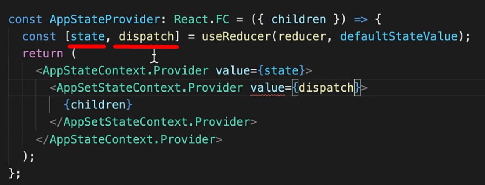
                1. when implementing `dispatch`... new error
                    1. undefined `value` within `<AppSetStateContext>`
                        1. 
                    1. investigate type of `dispatch`
                        1. 
                    1. re-define type of `value` within `<AppSetStateContext>`
                        1. scroll up to where `export const AppSetStateContext` is defined
                            1. defined here
                                1. 
                            1. Replace `React.Dispatch` with that from `dispatch`
                                1. 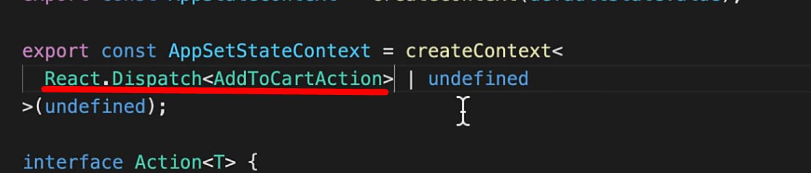
                1. renaming from `AppSetState` to `AppDispatch`
                    1. from...
                        1. 
                    1. to...
                        1. 
                    1. from...
                        1. 
                    1. to...
                        1. 
                    1. to...
                        1. 
        1. Updating `Pizza.tsx` component
            1. replace setState with dispatch
            1. defined click handler to utilize dispatch
            1. ERROR!!
                1. `quantity` is being handled at `AppState.tsx`
                    1. utilize `Omit` to remove `quantity` from `CartItem`
                1. within `AppStateProvider`
                    1. useReducer error...
                        1. 
                    1. inconsistency between returned `reducer` and object returned
                        1. `AppStateValue` utilizing `CartItem` that requires `quantity`
                            1. 
                        1. `itemToAdd` does NOT have `quantity`
                            1. `id`, `name`, `price`... but NO `quantity`
                                1. 
                    1. resolve inconsistency within `reducer` by ...
                        1. within `reducer`...
                            1. replace `itemToAdd`
                                1. 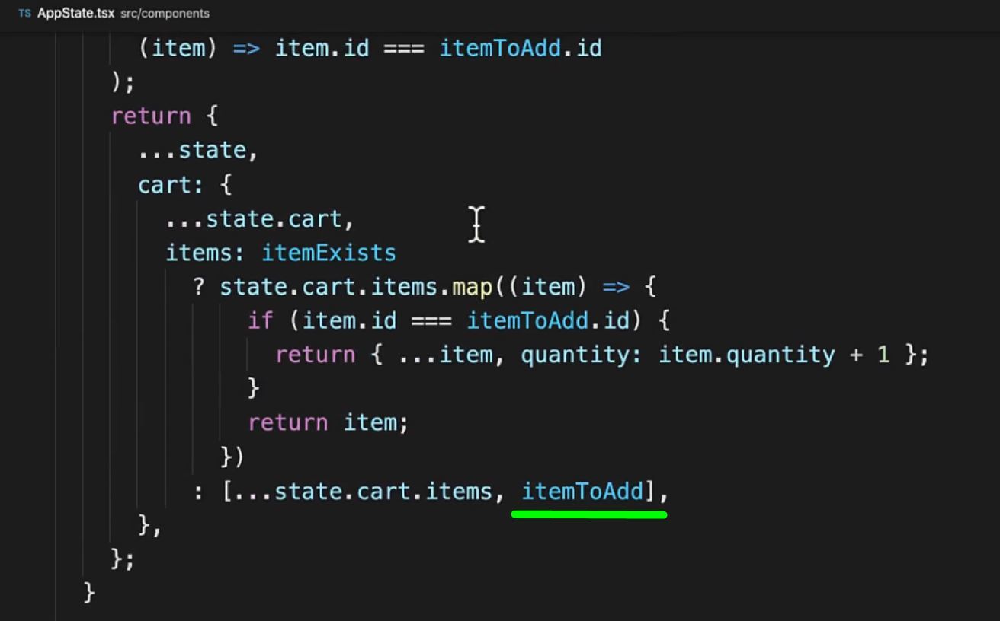
                            1. ...with destructured `itemToAdd` and `quantity`
                                1. 
        1. Verify that it works
            1. 
            1. PROBLEM!!! 4 Napolentana is not 3 pizzas
                1. Updating Cart to display correct number of pizza
                    1. 
                1. implementing `item.quantity` and `sum` via `state.cart.items.reduce()`
                    1. 
            

</details>

##### Store cart data in local storage (useEffect hook)

<details>
<summary>Expand</summary>

1. Store cart data in local storage (useEffect hook)
    1. Basics about `useEffect`
        1. functions that are triggered by change in designated variable 
    1. Where does `useEffect` fit in?
        1. trigger a `LocalStorage` function to store app data in the browser 
            1. whenever cart data changes
    1. Before use... always check documentation
        1. 
    1. Plan out what you want
        1. Storing into LocalStorage
            1. Callback
                1. utilize `window` library b/c it is part of the browser
                    1. 
                1. what callback should look like
                    1. 
            1. Dependency
                1. we want the callback to occur EVERY TIME `state.cart` change
                    1. 
        1. Loading LocalStorage after initial load
            1. Callback - `getItem`
                1. what is `getItem`
                    1. 
                1. Action
                    1. Because we are changing state... must go through an action
                    1. Creating an action
                        1. create `interface` defining the initialization of Cart
                            1. 
                                1. we are accessing the `AppStateValue` type and accessing it's cart value
                    1. Add newly created action to `reducer`
                        1. 
                            1. add to the function arrow's parameter `()`
                            1. fit it in via `|` union marker
                    1. Add logic `if` the `action.type` is `INITIALIZE_CART`
                        1. logic should destructure `state` and just assign cart value
                            1. 
                1. Checking type
                    1. problem!!!
                        1. 
                        1. NEED TO WRAP UP NULL'S
                    1. null check
                        1. 
                1. create `dispatch`
                    1. `dispatch` that consists of `type` and `payload`
            1. Dependency 
                1. 
                    1. Blank `[]` array to symbolize that it loads on first
            1. PROBLEM!!! `set` runs before `get`
                1. Sets an empty cart to LocalStorate PRIOR to retrieving from LocalStorage
            1. SOLUTION!!! switch `get` and `set` `UseEffect`'s
                1. 
                1. 
            1.  
                
    
            
</details>

##### Creating a Higher Order Component - part 1

<details>
<summary>Expand</summary>

1. Creating a Higher Order Component - part 1
    1. Adding a `SpecialOffer` component that will wrap all other components
        1. Basic
            1. import, function constant, export
                1. 
        1. Copy JSX markup for html + button
            1. 
        1. Because state is NOT created... functional component
            1.  
        1. Copy `interface` from Pizza and share it
            1. `Pizza.tsx`
                1. 
            1. `types.ts`
                1. 
            1. Share it with...
                1. `Pizza.tsx`
                    1. 
                1. `SpecialOffer.tsx`
                    1. 
        1. Copy `Pizza.tsx`'s `dispatch` and `handle`click 
            1. `Pizza.tsx`
                1.  
            1. `SpecialOffer.tsx`
                1. 
        1. Bring `SpecialOffer` component to `App.tsx`
            1. Specify that we want pizza `3` with special offer
                1. 
            1. `.find()` the `pizza` with the `.specialOffer` property
                1.  
        1. type-check your variables
            1. `specialOfferPizza` is suppose to hold the pizza..
                1. 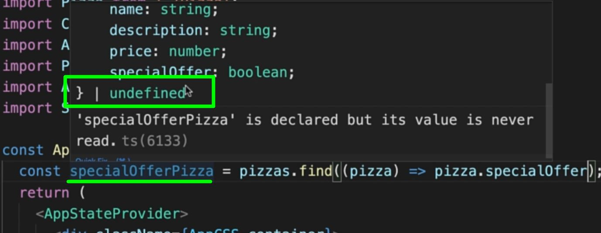
                    1. ...but it can be passed as `undefined`
            1. Need to null-check with `&&`
                1. 
        1. ERROR -- too many `Pizza`
            1. 
                1. Rename `Pizza` to `PizzaItem`
        1. Checking results
            1. 
            
            
        

</details>

##### Creating a Higher Order Component - part 2

<details>
<summary>Expand</summary>

1. Creating a Higher Order Component - part 2
    1. Basic
        1. Higher-order component allows us to share
            1. `add to card` functionality between...
                1. `SpecialOffer`
                1. `Pizza` 
        1. Higher-order component will share...
            1. 
        1. We assume that we will pass `CartItem` as a type through
            1. ensure to export `CartItem` from `AppState.tsx`
                1. 
    1. setting up `HOC`
        1. `AddToCart.tsx`
            1. Basics
                1. What is should look like
                    1. 
                1. Basic Structure
                    1. Import
                    1. HOC that takes in `ChildComponent`
                        1. `ChildComponent` is of `React.ComponentType`
                    1. HOC consists of a function that `return`s `<ChildComponent`
                    1. `return` HOC function
    1. Adding functionality to `HOC`
        1. add handleClick function to HOC, within HOC function
            1. 
                1. import `CartItem` and use it to type enforce `item`
                1. create a handleClick function that `dispatch`es a payload with `item`
                1. be sure to `return` handleClick function
        1. implementing HOC onto childComponent... `Pizza.tsx`
            1. wrap the exported `PizzaItem` with addToCart
                1. 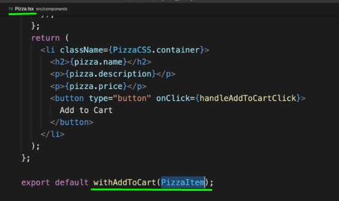
        1. Form-fitting `Pizza.tsx` to utilize `addToCart` functionality
            1. adding `addToCart` as a parameter to `PizzaItem` functional component
                1. Before
                    1. 
                1. After
                    1. 
                1. Problem!!! time to investigate
                    1. `addToCart` needs to be typed
                1. Solution -- export/import
                    1. Exporting a typed `addToCart`
                        1. Need to go back to root of `addToCart` ... `AddToCart.tsx`
                            1. need to define it as an interface 
                                1. 
                    1. Going back to `Pizza.tsx` and implement the exported `addToCart`
                        1. import and extend <Props> that utilizes `addToCart`
                            1. 
                1. Testing...
                    1. 
                        1. properly reads `addToCart`
            1. Cleaning up `dispatch`
                1. `dispatch` passed cart functionality to the reducer
                    1. no longer needed
                1. replace `dispatch` with `addToCart()`
                    1. before...
                        1. 
                    1. after...
                        1. 
                1. PROBLEM!!!!
                    1. Typescript wants us to include `quantity` to fulfil the type for `addToCart`
                        1. 
                1. SOLUTION
                    1. go back to `addToCart` and omit `quantity` from `CartItem`
    1. Fixing `addToCart`'s `CartItem`
        1. `Omit`ting `quantity` from `CartItem`
            1. Edit the `export interface` of `AddToCart.tsx`
                1. 
            1. Edit the `withAddToCard` function to type-check with `AddToCartProps` interface
                1. 
    1. Reviewing App.tsx
        1. Problem!!!
            1. TS demands to see `addToCart` to `<Pizza>`
                1. 
        1. Problem
            1. TS has a problem when you add `addToCart`
                1. 
            1. Why?
                1. Because `addToCart` was not part of `export interface`
        1. Solution
            1. go back to `Pizza.tsx`
                1. `Props` of `Pizza.tsx` is an extension of `AddToCartProps` from `AddToCart`
                    1. 
            1. go to `Props` of `AddToCart`
                1. Before
                    1. 
                1. What we want...
                    1. want to exclude all of `addToCart`'s `item` props
                        1. 
                        1. 
                    1. By excluding all of `addToCart` props...
                        1. `AddToCartHOC` can only export `addToCart()` function
                            1. 
                        1. by using `keyof`
                            1. we avoid going over every single type of `AddToCartProps`
    1. Reviewing `AddToCart.tsx`
        1. `AddToCartHOC` return has an error
            1. Problem...
                1. 
            1. Investigation
                1. 
            1. Solution
                1. Because TS does not recognize property as OriginalProps
                    1. Assert it `as OriginalProps`
                1. 
        1. Consistency with exporting `addToCart`
            1. Problem
                1. 
            1. Solution
                1., 
                        
        1. 
                        1. want 
            
1. ///////////////////////////////////////
    1. sdf
        1. sdf
            1. sadf
                1. sdf
                    1. import prop type into function via Generic
                        1. 
                    1. import prop type into component via Generic
                        1. 
                1. assert `props` to be `OriginalProps` type
                    1. 
        1. interface to enforce `CartItem` type input for `addToCart`
            1. ensure to `Omit<>` quantity...
                1.  
            1. `quantity` is already handled by `reducer`
            1. implement `interface` onto onClick function
                1. 
        1. form-fitting `addToCart` to rest of `Pizza.tsx`
    1. do NOT forget about parent component... `App.tsx`
        1. 
        1. Need to omit properties
            1. properties are already added downstream
                1. 

</details>

##### Creating a Render Props component

<details>
<summary>Expand</summary>

1. Creating a Render Props component

</details>

##### Creating a custom hook

<details>
<summary>Expand</summary>

1. Creating a custom hook

</details>

##### Handling original DOM events

<details>
<summary>Expand</summary>

1. Handling original DOM events

</details>

</details>

<hr />


#### Section 3 LEGACY React With TypeScript

<details>
<summary>Expand</summary>

##### Introduction

<details>
<summary>Expand</summary>

1. Introduction

</details>

##### Function Components

<details>
<summary>Expand</summary>

1. Function Components

</details>

##### Class Components

<details>
<summary>Expand</summary>

1. Class Components

</details>

##### Higher Order Components - React Redux

<details>
<summary>Expand</summary>

1. Higher Order Components - React Redux

</details>

##### Higher Order Components - Creating HOCs

<details>
<summary>Expand</summary>

1. Higher Order Components - Creating HOCs

</details>

##### Render Props

<details>
<summary>Expand</summary>

1. Render Props

</details>

##### Event Handling

<details>
<summary>Expand</summary>

1. Event Handling

</details>

##### Introduction to Hooks

<details>
<summary>Expand</summary>

1. Introduction to Hooks

</details>

##### Hooks: useState

<details>
<summary>Expand</summary>

1. Hooks: useState

</details>

##### Hooks: useEffect

<details>
<summary>Expand</summary>

1. Hooks: useEffect

</details>

</details>

<hr />


#### Section 3 Building a React Redux App

<details>
<summary>Expand</summary>

##### Building a React Redux App Section Introduction

<details>
<summary>Expand</summary>

1. Building a React Redux App Section Introduction

</details>

##### What if you haven't used Redux before?

<details>
<summary>Expand</summary>

1. What if you haven't used Redux before?

</details>

##### Initial Setup

<details>
<summary>Expand</summary>

1. Initial Setup

</details>

##### Setting Up a Fake Server

<details>
<summary>Expand</summary>

1. Setting Up a Fake Server

</details>

##### Setting Up Redux

<details>
<summary>Expand</summary>

1. Setting Up Redux

</details>

##### Creating the Recorder Component

<details>
<summary>Expand</summary>

1. Creating the Recorder Component

</details>

##### Creating the Event List Component

<details>
<summary>Expand</summary>

1. Creating the Event List Component

</details>

##### Loading Events - Part 1

<details>
<summary>Expand</summary>

1. Loading Events - Part 1

</details>

##### Loading Events - Part 2 (using connect)

<details>
<summary>Expand</summary>

1. Loading Events - Part 2 (using connect)

</details>

##### Creating Events

<details>
<summary>Expand</summary>

1. Creating Events

</details>

##### Deleting Events

<details>
<summary>Expand</summary>

1. Deleting Events

</details>

##### Editing Titles

<details>
<summary>Expand</summary>

1. Editing Titles

</details>

##### Useful Links

<details>
<summary>Expand</summary>

1. Useful Links

</details>

</details>

<hr />


#### Section 6 Building the Tasks App

<details>
<summary>Expand</summary>


</details>

##### Introduction

<details>
<summary>Expand</summary>

1. Introduction

</details>

##### Resources to help you get started with Next.js (Optional)

<details>
<summary>Expand</summary>

1. Resources to help you get started with Next.js (Optional)

</details>

##### Section tips (Optional)

<details>
<summary>Expand</summary>

1. Section tips (Optional)

</details>

##### Setting up a Next.js project with TypeScript

<details>
<summary>Expand</summary>

1. Setting up a Next.js project with TypeScript

</details>

##### Explaining the tsconfig options

<details>
<summary>Expand</summary>

1. Explaining the tsconfig options

</details>

##### Explaining the esModuleInterop option

<details>
<summary>Expand</summary>

1. Explaining the esModuleInterop option

</details>

##### Setting up the GraphQL API route

<details>
<summary>Expand</summary>

1. Setting up the GraphQL API route

</details>

##### Setting up a local MySQL server

<details>
<summary>Expand</summary>

1. Setting up a local MySQL server

</details>

##### Creating resolvers for the "tasks" query and "createTask" mutation

<details>
<summary>Expand</summary>

1. Creating resolvers for the "tasks" query and "createTask" mutation

</details>

##### Adding GraphQL code generator for the back end

<details>
<summary>Expand</summary>

1. Adding GraphQL code generator for the back end

</details>

##### Finishing the GraphQL API

<details>
<summary>Expand</summary>

1. Finishing the GraphQL API

</details>

##### Setting up Apollo Client

<details>
<summary>Expand</summary>

1. Setting up Apollo Client

</details>

##### Generating types for the front end

<details>
<summary>Expand</summary>

1. Generating types for the front end

</details>

##### Adding styles

<details>
<summary>Expand</summary>

1. Adding styles

</details>

##### Adding the form for creating tasks

<details>
<summary>Expand</summary>

1. Adding the form for creating tasks

</details>

##### Running the "createTask" mutation

<details>
<summary>Expand</summary>

1. Running the "createTask" mutation

</details>

##### Adding the form for updating tasks

<details>
<summary>Expand</summary>

1. Adding the form for updating tasks

</details>

##### Running the "updateTask" mutation

<details>
<summary>Expand</summary>

1. Running the "updateTask" mutation

</details>

##### Deleting tasks

<details>
<summary>Expand</summary>

1. Deleting tasks

</details>

##### Filtering tasks by task status

<details>
<summary>Expand</summary>

1. Filtering tasks by task status

</details>

##### Marking the tasks as completed

<details>
<summary>Expand</summary>

1. Marking the tasks as completed

</details>

##### Using a single page to render the tasks

<details>
<summary>Expand</summary>

1. Using a single page to render the tasks

</details>

##### Using a single page to render the tasks list

<details>
<summary>Expand</summary>

1. Using a single page to render the tasks list

</details>

</details>

<hr />

#### Section 7 LEGACY Building the Tasks App

<details>
<summary>Expand</summary>

1. Building the Tasks App Section Introduction
1. Important - please read this before watching the videos
1. Setting Up Next.js with TypeScript
1. Explaining the "tsconfig" Options
1. Explaining the "esmoduleinterop" Option
1. Adding Apollo
1. Running the local GraphQL API server
1. Running the first GraphQL query
1. Generate types for queries and mutations using GraphQL Code Generator
1. Generate types for queries and mutations using GraphQL Code Generator
1. Adding styles
1. Moving the task list into its own component
1. Adding the "create task" form - part 1 - creating the mutation
1. Adding the "create task" form - part 2 - creating the form
1. Adding the "create task" form - part 3 - running the mutation
1. Adding the "update task" form - part 1 - preparing the queries
1. Adding the "update task" form - part 2 - creating the "update" page
1. Adding the "update task" form - part 3 - creating the "update" form
1. Adding the "update task" form - part 4 - running the "updateTask" mutation
1. Coding the "delete task" feature
1. Coding the "change task status" feature (the checkboxes)
1. Coding the task filter
1. Fix the tasks query's cache policy causing an extra request on initial page load
1. Using React Context to pass task status to child components of main page

</details>

<hr />

#### Section 8 Cheatsheets

<details>
<summary>Expand</summary>

1. Using TypeScript with React
1. Using TypeScript with Next.js

</details>

<hr />